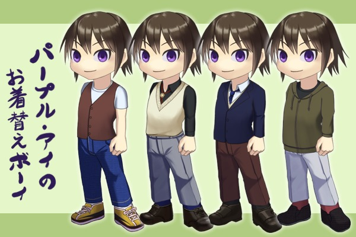

# パープル・アイの着せ替えボーイ

## これは何？

伺か用フリーシェル(立ち絵)「パープル・アイの着せ替えボーイ」の公開レポジトリです。

着せ替えがついた少年のフリーシェルです。SSP専用です。

簡単なオーナードローメニュー素材がついています。

ポーズ差分あり。
また、neverアニメーションで表情に効果を付けることができます。

シェルのダウンロードは
[`Releasesの最新版`](https://github.com/tukinami/purple-eyed-dressed-up-boy/releases/latest)からどうぞ。

## ダウンロードできる内容は？

### purple-eyed-dressed-up-boy.zip

フリーシェル本体です。
名前は「パープル・アイの着せ替えボーイ」で、縦615pxです。

## 表情・ポーズ一覧

## 表情効果アニメーション

詳しい使い方については`readme.txt`を参照してください。

- 照れ
- 汗
- 影

## 当たり判定

- Head
- Shoulder
- Hand

当たり判定上ではマウスカーソルが変わるように設定されています。

## 着せ替え箇所

- 靴下
- 靴
- ボトムス
- シャツ
- タイ (Ｙシャツ専用)
- ベスト
- アウター

## 作成協力

### 灯坂アキラ さん

surfaces.txt等の記述をお願いいたしました。
ありがとうございます。

## ライセンス

[CC BY 4.0](https://creativecommons.org/licenses/by/4.0/) にて配布いたします。
([日本語版ライセンス](https://creativecommons.org/licenses/by/4.0/deed.ja))

## 連絡先

- [Peing質問箱](https://peing.net/ja/tukinami_seika)
- [Mastodon(fedibird)](https://fedibird.com/@tukinami_seika)
- [Mastodon(うかどん)](https://ukadon.shillest.net/@tukinami_seika)

## 製作者

月波 清火

- [GitHub](https://github.com/tukinami)
- [github.io(これまで公開した制作物)](https://tukinami.github.io)
